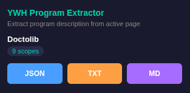

# YWH Program Description Extractor

A Chrome extension to extract program descriptions from [YesWeHack](https://yeswehack.com) program pages and export them as **JSON**, **TXT**, or **Markdown**.

## Features

- Extracts program data from the active YesWeHack program page
- Exports in three formats: JSON, TXT, Markdown
- Dark-themed popup UI
- Extracts:
  - Program title, URL, type, visibility
  - Full program description
  - Reward grid (Low / Medium / High / Critical)
  - All in-scope assets with type, report count, and asset value
  - Out-of-scope items
  - Qualifying and non-qualifying vulnerability types
  - User-agent requirement



## Installation

### From release (recommended)

1. Download the latest `.zip` from the [Releases](../../releases) page
2. Unzip the archive
3. Open `chrome://extensions` in Chrome
4. Enable **Developer mode** (top-right toggle)
5. Click **Load unpacked** and select the unzipped folder

### From source

```bash
git clone https://github.com/GRodolphe/YWHGetDesc.git
```

Then load the cloned folder as an unpacked extension (same steps 3-5 above).

## Usage

1. Navigate to a YesWeHack program page (e.g. `https://yeswehack.com/programs/<program-name>`)
2. Click the extension icon in the toolbar
3. The popup shows the program title and scope count
4. Click **JSON**, **TXT**, or **MD** to download the extracted data

## Export formats

### JSON

Structured object with all extracted fields, suitable for programmatic use.

### TXT

Human-readable plain text with sections for rewards, description, scopes, and vulnerability types.

### Markdown

Formatted markdown with tables for rewards and scopes, bullet lists for vulnerabilities.

## Project structure

```
YWHGetDesc/
  manifest.json    # Chrome extension manifest (MV3)
  content.js       # Content script - DOM extraction logic
  popup.html       # Extension popup UI
  popup.js         # Popup logic and download handling
  icons/
    icon48.png     # Toolbar icon
    icon128.png    # Extension page icon
```

## Permissions

- `activeTab` - Access the current tab only when the extension icon is clicked

## Release

Releases are automated via GitHub Actions. To create a new release:

1. Create and push a version tag:
   ```bash
   git tag v1.0.0
   git push origin v1.0.0
   ```
2. The workflow builds a `.zip` package, generates an SBOM (CycloneDX format), and attaches both to the GitHub release.

## License

MIT
